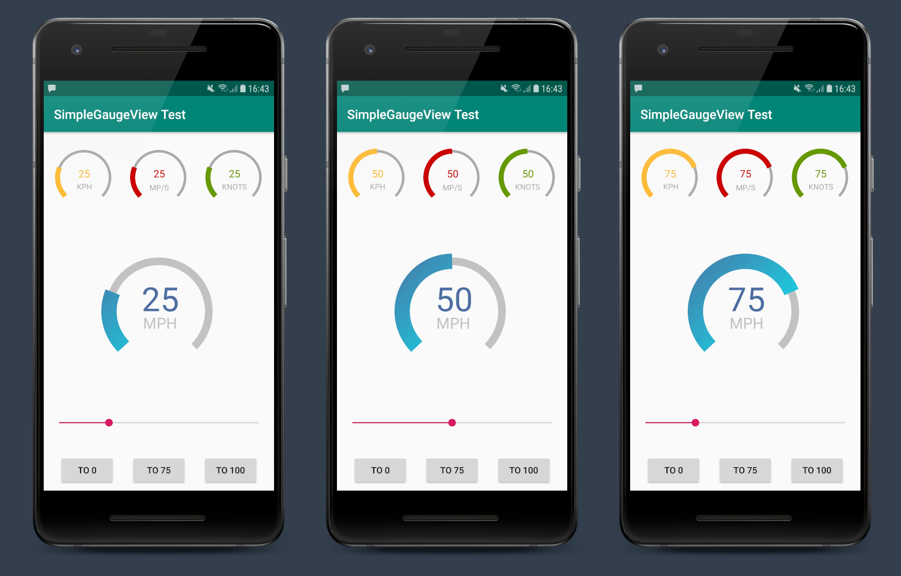

# simple-gauge-view
A simple custom gauge view for Android

Just a pretty basic gauge view control I wrote for my Road Trip Tracker application. I thought it might be useful as
as starting point if anyone wants to use it to build something a bit more advanced.



## Configuration
The view currently supports the following XML configuration attributes.


```xml
<resources>
    <declare-styleable name="SimpleGaugeView">

        <attr name="gaugeView_barWidth" format="dimension" />
        <attr name="gaugeView_fillBarWidth" format="dimension" />

        <attr name="gaugeView_barColor" format="color" />
        <attr name="gaugeView_fillColor" format="color" />

        <attr name="gaugeView_fillColorStart" format="color" />
        <attr name="gaugeView_fillColorEnd" format="color" />

        <attr name="gaugeView_strokeCap" format="enum">
            <enum name="butt" value="0" />
            <enum name="round" value="1" />
            <enum name="square" value="2" />
        </attr>

        <attr name="gaugeView_startAngle" format="float" />
        <attr name="gaugeView_sweepAngle" format="float" />

        <attr name="gaugeView_value" format="integer" />
        <attr name="gaugeView_minValue" format="integer" />
        <attr name="gaugeView_maxValue" format="integer" />
        <attr name="gaugeView_showValue" format="boolean" />

        <attr name="gaugeView_textSize" format="dimension" />
        <attr name="gaugeView_textColor" format="color" />
        <attr name="gaugeView_textOffset" format="dimension" />

        <attr name="gaugeView_labelSize" format="dimension" />
        <attr name="gaugeView_labelColor" format="color" />
        <attr name="gaugeView_labelText" format="string" />

    </declare-styleable>
</resources>
```

## Usage

```XML
<ie.justonetech.simplegaugeview.SimpleGaugeView
    android:id="@+id/speedGaugeView0"
    android:layout_width="200dp"
    android:layout_height="200dp"
    android:padding="10dp"

    app:gaugeView_barWidth="12dp"
    app:gaugeView_fillColorEnd="#ff00ffff"
    app:gaugeView_fillColorStart="#ff4d6ea3"
    app:gaugeView_labelSize="24sp"

    app:gaugeView_labelText="MPH"
    app:gaugeView_maxValue="100"
    app:gaugeView_strokeCap="butt"
    app:gaugeView_textSize="52sp"
    app:gaugeView_value="25"
 />
```
